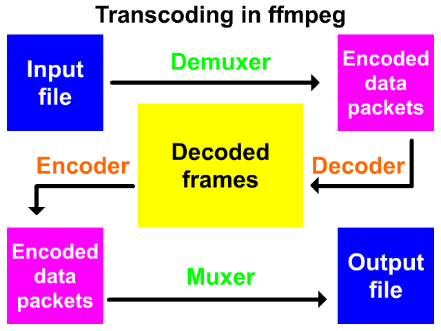

# ffmpeg_tutorials
学习FFmpeg系列教程(从最基础的C语法->编写实用的C++播放器->前沿视频合成技术)

使用的操作系统 Ubuntu 18.10  
编译器 gcc (Ubuntu 8.2.0-7ubuntu1) 8.2.0  
集成开发环境 CLion 2018.3.4  
管理 CMake
  
邮件讨论  wangrl2016@gmail.com

## C语言进阶
主要讲指针，内存管理，和文件读写操作。因为音视频很多都是以文件的形式存在，需要手动管理内存，指针又是必不可少的。
参考《Pointers On C》写的部分代码示例。
### 01 A Quick Start
1. `rearrange_characters.c` 字符串的输入输出处理。

    

## FFmpeg安装
1. 下载源码
	`git clone https://github.com/FFmpeg/FFmpeg`	
2. ./configure
	进行配置，可以通过`./configure --help`进行查看。  
	`--enable-shared`编译动态库。
3. `make` && `sudo make install`
　　头文件在/usr/local/include/目录下面，生成库文件在/usr/local/lib/目录下面。 

## FFmpeg概述
主要库文件  
libavcodec encoding/decoding library  
libavfilter graph-based frame editing library  
libavformat I/O and muxing/demuxing library  
libavdevice special devices muxing/demuxing library  
libavutil common utility library  
libswresample audio resampling, format conversion and mixing  
libpostproc post processing library  
libswscale color conversion and scaling library  
    
牢记上面这张图，接下来的部分都会围绕这张图展开，其中很重要的几个概念，Demuxer, Muxer, Packet, Frame, Decoder, Encoder，后续后详
细介绍。先介绍命令行的使用，然后开始编写代码，需要的资源文件在res/目录下面。

    
## FFmpeg命令行使用
### 01. FFmpeg Fundamentals
ffmpeg终端语法规则  
`ffmpeg [global options] [input file options] -i input_file [output file options] output_file`  

`ffmpeg -f lavfi -i rgbtestsrc -pix_fmt yuv420p -f sdl Example`  
输出视频并调用sdl显示。

`ffplay -f lavfi -i testsrc -vf transpose=1`
`ffmpeg -i input.mp3 -af atempo=0.8 output.mp3`  
-vf表示video filters, -af表示audio filters.

### 02. Displaying Help and Features
### 03. Bit Rate, Frame Rate and File Size
### 04. Resizing and Scaling Video
### 05. Cropping Video
### 06. Padding Video
### 07. Flipping and Rotating Video
### 08. Blur, Sharpen and Other Denoising
### 09. Overlay-Picture in Picture
### 10. Adding Text on Video
### 11. Conversion Between Formats
### 12. Time Operations
### 13. Mathematical Functions
### 14. Metadata and Subtitles
### 15. Image Processing
### 16. Digital Audio
### 17. Presets for Codecs
### 18. Interlaced Video
### 19. FFmpeg Components and Projects
### 20. Microphone and Webcam
### 21. Batch Files
### 22. Color Corrections
### 23. Advanced Techniques
### 24. Video on Web
### 25. Debugging and Tests

## 音视频基本概念

## FFmpeg官方示例
详细解释都在代码注释中。  
1. `metadata.c` 读取文件的元数据输出。  
调用avformat_open_input函数构造AVFormatContext结构体，相当于Android中的Context角色，提供编解码过程中需要的各种资源。
访问AVDictionary* AVFormatContext::metadata属性，通过while循环不断查询获取metadata的key和value值。
2. `decode_video.c` 解码视频的前几帧，保存为灰度图片。  
构建AVFormatContext结构体，轮询视频文件中的流信息，使用查询到的视频流构建AVCodecContext。然后创建AVFrame和AVPacket，通过
avcodec_send_packet函数将将视频数据送到AVPacket中，通过avcodec_receive_frame函数传递到AVFrame中，最终写入到文件。 
3. `encode_video.c` MPEG4编码2秒钟的视频，可以使用播放器播放。  
通过avcodec_find_encoder构造AVCodec，进而构造AVCodecContext，然后传入参数对AVCodecContext进行设置，比如视频编码格式，宽和高等。
构建AVPacket和AVFrame结构体，向AVFrame中填充YUV数据，通过avcodec_send_frame和avcodec_receive_packet函数将数据传递到AVPacket中，
最终AVPacket写入到文件中。
4. `scaling_video.c` 通过sws_scale函数转换视频的尺寸。  
将生成的的帧图片转换存入到另外的文件中。
5. `filtering_video.c` 改变视频的尺寸和转置90度从终端输出。  
和`decode_video.c`相同的处理获取Frame，然后通过avfilter_graph_create_filter构建两个filter，graph的意义还需要后续再分析，最后改变后的Frame从终端输出。
6. `hw_decode.c` 硬件加速。  
解码过程和`decode_video.c`类似，添加av_hwdevice_ctx_create函数创建AVBufferRef指针。

    
## 音视频图像协议
**注: 协议解读是html文件，需要下载下来使用浏览器打开。**  
[Bootstrap Documentation](media_specifications/bootstrap_documentation.html)
很fashion的前端库，方便写html网页。
主要是Bootstrap的Layout, Content, Components, Utilities示例。  

### PNG协议
[Portable Network Graphics (PNG) Specification (Second Edition)](https://www.w3.org/TR/PNG/)  
samples, channels, pixels, and sample depth之间的关系  
  

编码流程PNG image -> Pass extraction -> Scanline serialization -> Filtering -> Compression -> Chunking -> 
Datastream construction   

PNG数据流由一系列的chunks构造，重要的四个
- `IHDR` 文件头  
- `PLTE` palette表
- `IDAT` 数据chunks
- `IEND` 文件结束  

详细介绍查看网页[PNG协议解读](media_specifications/portable_network_graphics_specification.html)

### AAC

### FLAC

### H264

## FFmpeg源码分析

## C++语言进阶
示例参考[cppreference官网](https://en.cppreference.com/w/)
### General utilities library
#### Smart pointers and allocators 智能指针
`unique_ptr_test.cpp` 通过make_unique创建对象，通过move进行对象的转移，只允许一个指针拥有该对象实例。  
`shared_ptr_test.cpp` 多个指针可以指向同一个对象，对象的引用计数use_count增加。  
`weak_ptr_test.cpp` 不会引起use_count的增加。
### Containers library
### Algorithms library
### Thread support library

## SFML框架编写
SFML的安装`sudo apt-get install libsfml-dev`  
测试代码 `sfml/examples/SFMLTest.cpp`

### System module
### Window module
### Graphics module
### Audio module
### Network module

## 流媒体

## 编写多媒体播放器

# Advance topics:

## 算法复习
以`Introduction to Algorithms`为蓝本学习算法。
### Foundations
### Sorting and Order Statistics
### Data Structures
### Advanced design and Analysis Techniques
### Advanced Data Structures
### Graph Algorithms
### Select Topics

### CRC校验
在需要传递的数据后面加上一串数据，这串数据是对需要传递的数据进行计算得到的，通过比较加上的数据验证传递的数据是否正确。  
[crc实现](basic_algorithms/crc_impl)
详细的解释查看  
[A Painless Guide to CRC Error Detection Algorithms](http://ross.net/crc/download/crc_v3.txt)

## 多媒体算法 (media_algorithms)

### pngquant PNG压缩算法  (未完成)

## 软件架构基础
### Design Patterns

## 多媒体框架
### VLC

### NuPlayer

### EXOPlayer

## 图像处理和识别
### Skia (工作使用)

### OpenCV 

## Leetcode答案 (C++实现)
[Leetcode官网](https://leetcode.com/problemset/all/)  
每天至少刷一道习题。

## 3D

### filament

### three.js

  

