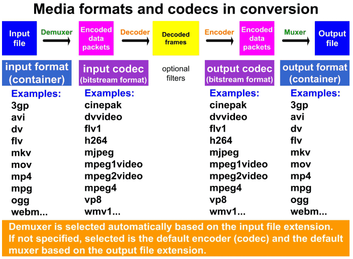

# ffmpeg_tutorials
学习多媒体系列教程(从最基础的C语法->编写实用的C++播放器->前沿音视频处理技术)

使用的操作系统 Ubuntu 18.10  
编译器 gcc (Ubuntu 8.2.0-7ubuntu1) 8.2.0  
集成开发环境 CLion 2018.3.4  
管理 CMake
  
邮件讨论  wangrl2016@gmail.com    

## C语言进阶
主要讲指针，内存管理，和文件读写等C高级操作。  
参考《Pointers On C》写的部分代码示例。  
### 01. A Quick Start
字符串的输入输出处理。   

*注：跳过语法，函数，数组，指针基础章节。*  

### 02. Structures and Unions
主要讲结构体，初始化，和结构体指针。

### 03. Dynamic Memory Allocation
分配`void* malloc(size_t size);`  
释放`void free(void *pointer);`  

### 04. Using Structures and Pointers
通过链表来介绍结构体和指针知识。  
如果需要修改指针的指向，需要传递双重指针，因为指针在函数中也是按值传递。  

--- 

  

    

## FFmpeg安装
1. 下载源码
	`git clone https://github.com/FFmpeg/FFmpeg`	
2. ./configure
	进行配置，可以通过`./configure --help`进行查看。  
	`--enable-shared`编译动态库。
3. `make` && `sudo make install`  
头文件在/usr/local/include/目录下面，生成库文件在/usr/local/lib/目录下面。 

## FFmpeg概述
主要库文件  
`libavcodec` encoding/decoding library  
`libavfilter` graph-based frame editing library  
`libavformat` I/O and muxing/demuxing library  
`libavdevice` special devices muxing/demuxing library  
`libavutil` common utility library  
`libswresample` audio resampling, format conversion and mixing  
`libpostproc` post processing library  
`libswscale` color conversion and scaling library  
    
牢记上面这张图，接下来的部分都会围绕这张图展开，其中很重要的几个概念，Demuxer, Muxer, Packet, Frame, Decoder, Encoder，后续后详
细介绍。先介绍命令行的使用，然后开始编写代码，需要的资源文件在res/目录下面。

    
## FFmpeg命令行使用
主要熟悉FFmpeg的功能
### 01. FFmpeg Fundamentals
ffmpeg终端语法规则  
`ffmpeg [global options] [input file options] -i input_file [output file options] output_file`  

`ffmpeg -f lavfi -i rgbtestsrc -pix_fmt yuv420p -f sdl Example`  
输出视频并调用sdl显示。

`ffplay -f lavfi -i testsrc -vf transpose=1`
`ffmpeg -i input.mp3 -af atempo=0.8 output.mp3`  
-vf表示video filters, -af表示audio filters.

### 02. Displaying Help and Features
ffmpeg -h decoder=flv  
ffmpeg -codecs  
ffmpeg -filters  
ffmpeg -formats  
ffmpeg -protocols
  
### 03. Bit Rate, Frame Rate and File Size
ffmpeg -i input.avi -r 30 output.mp4
指定帧率

video_size = video_bitrate * time_in_seconds / 8  
audio_size = sampling_rate * bit_depth * channels * time_in_seconds / 8

### 04. Resizing and Scaling Video
ffmpeg -i input.avi -s vga output.avi  
指定播放尺寸 640x480  

ffmpeg -i input.mpg -vf scale=iw*0.9:ih*0.9 output.mp4

### 05. Cropping Video (视频裁剪)
ffmpeg -f lavfi -i testsrc -vf crop=29:52:256:94 -t 10 timer1.mpg  
相对左上原点的距离加上输出视频的长和宽。

### 06. Padding Video (增加额外的区域)
ffmpeg -i input -vf pad=iw:iw*3/4:0:(oh-ih)/2:color output  
将视频从16:9转化为4:3

### 07. Flipping and Rotating Video
ffplay -f lavfi -i rgbtestsrc -vf vflip  
视频转置

ffmpeg -i CMYK.avi -vf transpose=1 CMYK_transposed.avi
顺时针转90度

### 08. Blur, Sharpen and Other Denoising
ffmpeg -i halftone.jpg -vf smartblur=5:0.8:0 blurred_halftone.png
模糊处理

ffmpeg -i input.mpg -vf mp=denoise3d output.webm  
锐化

### 09. Overlay-Picture in Picture
ffmpeg -i pair.mp4 -i logo.png -filter_complex overlay=W-w:H-h pair3.mp4  
覆盖，图片显示在右下角。

### 10. Adding Text on Video
添加文字

### 11. Conversion Between Formats
常见转换关系图  

### 12. Time Operations
ffmpeg -i input.avi -ss 10 output.mp4  
设置开始时间

### 13. Mathematical Functions  
ffplay -f lavfi -i aevalsrc=cos(523.251*2*PI*t)  
余弦函数

### 14. Metadata and Subtitles
元数据通过-metadata指定

ffmpeg -i video.avi -vf subtitles=titles.srt video.mp4

### 15. Image Processing
ffmpeg -i videoclip.avi -ss 01:23:45 image.jpg  
截取视频帧保存为图片

ffmpeg -i image.png -vf transpose=1 image_rotated.png

ffmpeg -f image2 -i img%d.jpg -r 25 video.mp4  
从图片中合成视频

### 16. Digital Audio
ffmpeg -f lavfi -i aevalsrc=sin\(440*2*PI*t\) -t 10 noteA4.mp4  
声音合成

ffmpeg -i stereo.wav -af pan=mono mono.wav  
双声道变成单声道

ffmpeg -i music.mp3 -af earwax -q 1 music_headphones.mp3  
增强耳机效果

### 17. Presets for Codecs
使用预置文件
vcodec=libx264  
vprofile=baseline  
level=13  
maxrate=768000
bufsize=3000000

### 18. Interlaced Video
扫描方式

### 19. FFmpeg Components and Projects
FFplay FFprobe FFmpeg  
libavcodec libavdevice libavfilter libavformat libavutil libpostproc libswresample libswscale
  
### 20. Microphone and Webcam
音视频录制

### 21. Batch Files
Bash

### 22. Color Corrections
ffplay -f lavfi -i smptebars -vf lutyuv=u=128:v=128  
黑白

ffplay -f lavfi -i rgbtestsrc -vf lutrgb=r=0:g=0  
过滤红色和绿色

yuv格式

### 23. Advanced Techniques
音视频连接  
concatenation merge(相对于音频流) mix(相对于channel) multiplex overlay

ffmpeg -i input1.avi -i input2.avi -filter_complex concat output.mp4

ffmpeg -i eagles.mpg -vf delogo=x=730:y=0:w=70:h=46:t=1 nologo.mpg  
移除logo

ffmpeg -i travel.avi -vf deshake fixed_travel.avi  
消除抖动

ffmpeg -i ship.avi -vf drawbox=x=150:w=600:h=400:c=yellow ship1.avi  
增加颜色框

ffmpeg -i audio.mp3 -vf showspectrum audio_spectrum.mp4  
音频光谱

[Festival Speech Synthesis System](http://festvox.org/festival/)  
语音合成引擎

## 音视频基本概念

## FFmpeg官方示例
详细解释都在代码注释中。  
1. `metadata.c` 读取文件的元数据输出。  
调用avformat_open_input函数构造AVFormatContext结构体，相当于Android中的Context角色，提供编解码过程中需要的各种资源。
访问AVDictionary* AVFormatContext::metadata属性，通过while循环不断查询获取metadata的key和value值。
2. `decode_video.c` 解码视频的前几帧，保存为灰度图片。  
构建AVFormatContext结构体，轮询视频文件中的流信息，使用查询到的视频流构建AVCodecContext。然后创建AVFrame和AVPacket，通过
avcodec_send_packet函数将将视频数据送到AVPacket中，通过avcodec_receive_frame函数传递到AVFrame中，最终写入到文件。 
3. `encode_video.c` MPEG4编码2秒钟的视频，可以使用播放器播放。  
通过avcodec_find_encoder构造AVCodec，进而构造AVCodecContext，然后传入参数对AVCodecContext进行设置，比如视频编码格式，宽和高等。
构建AVPacket和AVFrame结构体，向AVFrame中填充YUV数据，通过avcodec_send_frame和avcodec_receive_packet函数将数据传递到AVPacket中，
最终AVPacket写入到文件中。
4. `scaling_video.c` 通过sws_scale函数转换视频的尺寸。  
将生成的的帧图片转换存入到另外的文件中。
5. `filtering_video.c` 改变视频的尺寸和转置90度从终端输出。  
和`decode_video.c`相同的处理获取Frame，然后通过avfilter_graph_create_filter构建两个filter，函数av_buffersrc_add_frame_flags
表示输入到filter中，函数av_buffersink_get_frame表示从filter中输出。
6. `hw_decode.c` 硬件加速。  
解码过程和`decode_video.c`类似，添加av_hwdevice_ctx_create函数创建AVBufferRef指针。
7. `demuxing.c` 一种视频格式转换为另外一种视频格式。
通过输入输出文件的后缀创建相应的Context，转换对应的packet，最终写入到输出文件中。
8. `transcoding.c` demuxing, decoding, filtering, encoding and muxing 连续操作。
    
## 音视频图像协议
**注: 协议解读是html文件，需要下载下来使用浏览器打开。**  
[Bootstrap Documentation](media_specifications/bootstrap_documentation.html)
很fashion的前端库，方便写html网页。
主要是Bootstrap的Layout, Content, Components, Utilities示例。  

### PNG协议
[Portable Network Graphics (PNG) Specification (Second Edition)](https://www.w3.org/TR/PNG/)  
samples, channels, pixels, and sample depth之间的关系  
  

编码流程PNG image -> Pass extraction -> Scanline serialization -> Filtering -> Compression -> Chunking -> 
Datastream construction   

PNG数据流由一系列的chunks构造，重要的四个
- `IHDR` 文件头  
- `PLTE` palette表
- `IDAT` 数据chunks
- `IEND` 文件结束  

详细介绍查看网页[PNG协议解读](media_specifications/portable_network_graphics_specification.html)

### [WebP](https://chromium.googlesource.com/webm/libwebp/)协议  
编译  
`make -f makefile.unix`  
`./autogen.sh`  
`./configure --enable-everything`  
`make`  
`sudo make install`  

后续写实现

### AAC

### FLAC

### H264

## FFmpeg源码分析

## C++语言进阶
示例参考[cppreference官网](https://en.cppreference.com/w/)  
## 构造器
### General utilities library
#### Smart pointers and allocators 智能指针
`unique_ptr_test.cpp` 通过make_unique创建对象，通过move进行对象的转移，只允许一个指针拥有该对象实例。  
`shared_ptr_test.cpp` 多个指针可以指向同一个对象，对象的引用计数use_count增加。  
`weak_ptr_test.cpp` 不会引起use_count的增加。  
`allocator_test.cpp` 分配内存  
`lvalue_rvalue_test.cpp` 左值引用和右值引用  
右值引用延长临时变量的生命周期，可以简单地理解为左值可以取地址，右值不能取地址。
https://www.cnblogs.com/qicosmos/p/4283455.html

### Containers library
### Algorithms library
### Thread support library

## SFML框架编写
SFML的安装`sudo apt-get install libsfml-dev`  
测试代码 `sfml/examples/SFMLTest.cpp`

### System module
### Window module
### Graphics module
### Audio module
### Network module

---
## 流媒体
### RTMP
### RTSP
### RTP/RTCP
### HLS

---
## 编写多媒体播放器
### mpvplayer
### ijkplayer

# Advance topics

## Math

---
## 算法复习
以`Introduction to Algorithms`为蓝本学习算法。  
[算法笔记](basic_algorithms/introducation_to_algorithms.md)，代码也在对应文件夹。
### Foundations
1. The Role of Algorithms in Computing
2. Getting Started
3. Growth of Functions
4. Divide-and-Conquer
5. Probabilistic Analysis and Randomized Algorithms
### Sorting and Order Statistics
6. Heapsort
7. Quicksort
8. Sorting in Linear Time
9. Medians and Order Statistics
### Data Structures
10. Elementary Data Structures
11. Hash Tables
12. Binary Search Trees
13. Red-Black Trees
14. Augmenting Data Structures
### Advanced design and Analysis Techniques
15. Dynamic Programming
16. Greedy Algorithms
17. Amortized Analysis
### Advanced Data Structures
18. B-Trees
19. Fibonacci Heaps
20. van Emde Boas Trees
21. Data Structures for Disjoint Sets
### Graph Algorithms
22. Elementary Graph Algorithms
23. Minimum Spanning Trees
24. Single-Source Shortest Paths
25. All-Pairs Shortest Paths
26. Maximum Flow
### Select Topics
27. Multithreaded Algorithms
28. Matrix Operations
29. Linear Programming
30. Polynomials and the FFT
31. Number-Theoretic Algorithms
32. String Matching
33. Computational Geometry
34. NP-Completeness
35. Approximation Algorithms

---
## 多媒体算法 (media_algorithms)
### CRC校验
在需要传递的数据后面加上一串数据，这串数据是对需要传递的数据进行计算得到的，通过比较加上的数据验证传递的数据是否正确。  
[crc实现](basic_algorithms/crc_impl)
详细的解释查看  
[A Painless Guide to CRC Error Detection Algorithms](http://ross.net/crc/download/crc_v3.txt)

### pngquant PNG压缩算法  (未完成)

---
## 软件架构基础

## Design Patterns
将[java-design-patterns](https://github.com/iluwatar/java-design-patterns)改写成C++的实现方式。  
具体的分析在[soft_framework/design_patterns](soft_framework/design_patterns/design_patterns.md)目录。   
### abstract document

---
## 多媒体框架
### VLC

### NuPlayer

### EXOPlayer

---
## 图像处理和识别
## Skia (工作使用)
使用CMakeLists.txt进行重写，实现最基础的功能，不用考虑跨平台，也不用考虑优化等。  
### include 包含所有的公开头文件
### tools 工具
#### flags
CommandLineFlags.cpp
### src 源码
### tests 测试
skia_test.cpp   测试入口  
所有函数实现公共类都要进行测试，

## OpenCV 
### Core functionality
### Image Processing
### Image file reading and writing
### Video I/O
### High-level GUI
### Video Analysis
### Camera Calibration and 3D Reconstruction
### 2D Features Framework
### Object Detection
### Deep Neural Network module
### Machine Learning
### Clustering and Search in Multi-Demensional Spaces
### Computational Photography
### Image stitching
### Graph API

---
## Leetcode答案 (C++实现)
[Leetcode官网](https://leetcode.com/problemset/all/)的答案在[leetcode](leetcode)文件夹。  
都已经通过测试，而且大部分都是最优解，结合算法导论会理解更深刻。    
### Array
数组非常常见。
### Hash Table
hash = hashfunc(key)  
index = hash % array_size  

### Linked List
### Math 
### Two Pointers
### String
### Binary Search
### Divide and Conquer
### Dynamic Programming
### Backtracking
### Stack
### Heap
### Greedy
### Bit Manipulation
### Tree
### Depth-first Search
### Breadth-first Search
### Union Find
### Design
### Topological Sort
### Trie
### Binary Indexed Tree
### Segment Tree
### Binary Search Tree
### Recursion
程序不断调用本身，传递不同的参数，同时需要有结束条件。
### Brainteaser
### Memoization
### Queue
### Minimax
### Reservoir Sampling
### Map
### Geometry
### Random
### Rejection Sampling
### Sliding Window

---
## 3D

## filament

## three.js

  

